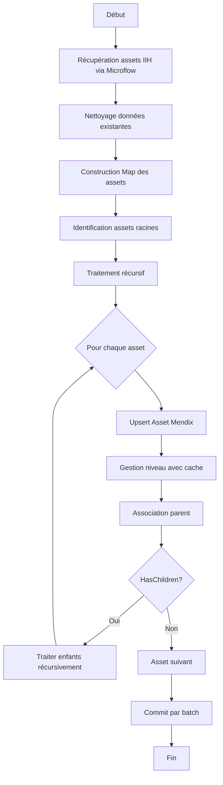
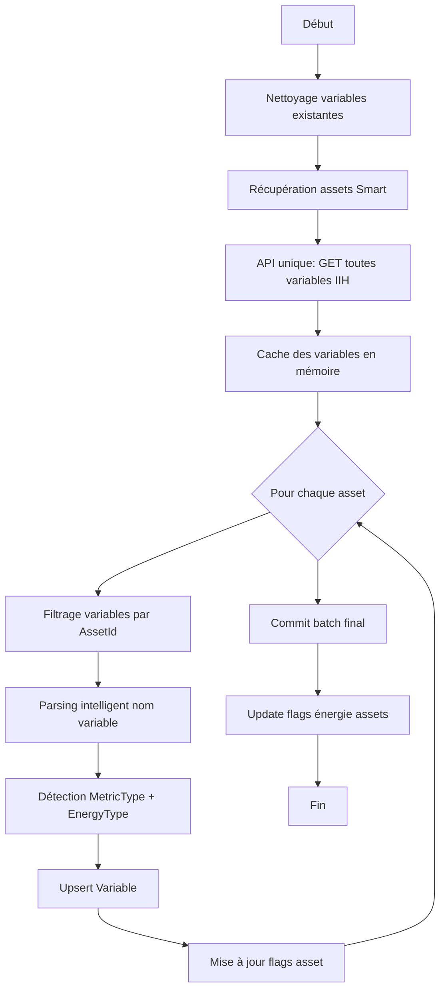

# Documentation du Système d'Assets IIH dans Mendix

## Vue d'ensemble

Votre système d'assets est conçu pour synchroniser et gérer une hiérarchie d'équipements industriels depuis IIH (Industrial IoT Hub) vers Mendix. L'architecture est optimisée pour gérer efficacement de grandes quantités de données avec des associations complexes.

## Architecture des Entités

### 1. **Asset** - Cœur du système
```
Asset
├── IIH_Id (String) - Identifiant unique IIH
├── Nom (String) - Nom de l'asset
├── HasChildren (Boolean) - Indicateur de présence d'enfants
├── Flags énergétiques
│   ├── isElec (Boolean)
│   ├── isGaz (Boolean)
│   ├── isEau (Boolean)
│   └── isAir (Boolean)
├── Métriques de consommation
│   ├── ConsoTotalElec/Gaz/Eau/Air (Decimal)
│   └── ConsoTotalElecPrev/GazPrev/EauPrev/AirPrev (Decimal)
├── Métriques IPE
│   ├── IPEElec/Gaz/Eau/Air (Decimal)
│   └── IPEElecKg/GazKg/EauKg/AirKg (Decimal)
└── Métriques de production
    ├── ProdTotal/ProdTotalPrev (Decimal)
    └── ProdTotalKg/ProdTotalPrevKg (Decimal)
```

**Associations:**
- `Asset_Parent` → Asset (auto-référence pour hiérarchie)
- `Asset_Level` → Level (niveau dans l'arbre)

### 2. **Variable** - Métriques des assets
```
Variable
├── IIH_Id (String) - Identifiant unique IIH
├── Name (String)
├── Unit (String) - Unité de mesure
├── DataType (String)
├── MetricType (Enum) - Type de métrique
│   ├── Conso (Consommation)
│   ├── IPE
│   ├── IPE_kg
│   ├── Prod (Production)
│   ├── Prod_kg
│   └── Custom
├── EnergyType (Enum) - Type d'énergie
│   ├── Elec
│   ├── Gaz
│   ├── Eau
│   ├── Air
│   └── None
└── LastSyncDate (DateTime)
```

**Association:**
- `Variable_Asset` → Asset (N:1)

### 3. **Level** - Niveaux hiérarchiques
```
Level
├── Name (String) - Ex: "L0", "L1", "L2"
├── SortOrder (Integer) - Ordre de tri
├── AssetCount (Integer) - Nombre d'assets à ce niveau
└── Métriques agrégées
    ├── ConsoTotalElec/Gaz/Eau/Air (Decimal)
    └── IPETotalElec/Gaz/Eau/Air (Decimal)
```

### 4. **TimeSeriesPoint** - Données temporelles
```
TimeSeriesPoint
├── Timestamp (DateTime)
├── Value (Decimal)
├── TimeSeriesPoint_Asset → Asset
└── TimeSeriesPoint_Variable → Variable
```

## Flux de Synchronisation

### Phase 1: ProcessIIHAssetTree



**Optimisations clés:**
- **Cache des niveaux**: `Map<Integer, IMendixObject> levelCache` évite les requêtes répétées
- **Traitement batch**: Commit par lots de `BATCH_SIZE` (configurable)
- **Map d'accès rapide**: `Map<String, Asset> assetMap` pour lookup O(1)
- **Double commit**: Force le refresh client pour synchronisation temps réel

### Phase 2: SyncIIHVariables



**Stratégie de parsing des variables:**
```java
// Patterns reconnus:
"consommation_elec" → MetricType.Conso + EnergyType.Elec
"ipe_kg_gaz" → MetricType.IPE_kg + EnergyType.Gaz
"production_kg" → MetricType.Prod_kg + EnergyType.None
```

## Optimisations Performances

### 1. **Stratégie de Cache**
- **Cache des niveaux**: Évite N requêtes pour N assets au même niveau
- **Cache des variables**: Une seule API call, puis filtrage en mémoire
- **Map des assets**: Recherche parent O(1) au lieu de O(n)

### 2. **Traitement Batch**
```java
if (buffer.size() >= BATCH_SIZE) {
    Core.commitWithoutEvents(ctx, buffer);
    stats.assetsCommitted += buffer.size();
    buffer.clear();
}
```

### 3. **Commits Optimisés**
- `commitWithoutEvents()`: Évite les triggers Mendix inutiles
- Double commit avec pause: Force la propagation au client
- Batch update des flags énergie en fin de sync

### 4. **Gestion Mémoire**
- Visiteur pattern avec `Set<String> visitedIds` pour éviter les cycles
- Profondeur max configurable (50 temps réel, 100 batch)
- Clear des buffers après chaque commit

## Envoi de Données IPE

### IIH_SendIPEToVariable
Envoie des mesures vers IIH avec:
- Construction JSON manuelle pour contrôle précis
- Validation stricte (timestamp, valeur numérique)
- Format ISO8601 pour les dates
- QualityCode fixé à 192

```java
// Format envoyé:
[{
    "timestamp": "2024-01-15T10:30:00.000Z",
    "value": 125.5,
    "qualitycode": 192
}]
```

## Modes de Fonctionnement

### Mode Temps Réel
- Max depth: 50
- Batch size réduit
- Refresh client fréquent
- Progress reporting désactivé

### Mode Batch (Scheduled)
- Max depth: 100
- Batch size élevé
- Progress reporting tous les 50 assets
- Optimisé pour volumes importants

## Points Clés d'Efficacité

1. **Association directe Asset↔Level**: Évite les jointures complexes
2. **Flags booléens sur Asset**: Requêtes XPath rapides `[isElec=true()]`
3. **Parsing intelligent des noms**: Catégorisation automatique des variables
4. **Cache multi-niveaux**: Minimise les accès DB
5. **Stratégie "Upsert"**: Create ou Update intelligent basé sur IIH_Id
6. **Nettoyage initial**: Table rase = pas de données orphelines

## Gestion des Erreurs

- Logging structuré avec emojis pour lisibilité
- Continue sur erreur variable (resilience)
- Statistiques détaillées (`ProcessingStats`, `VariableStats`)
- Métadonnées de sync avec statut et messages d'erreur

Cette architecture garantit une synchronisation efficace même avec des milliers d'assets et variables, tout en maintenant l'intégrité référentielle et la performance du système.