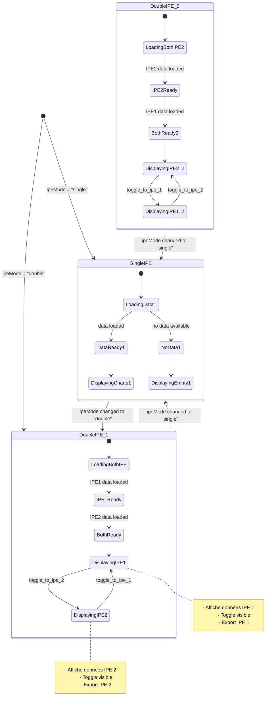

# Diagramme d'état : Fonctionnalité Double IPE

## Vue d'ensemble
Ce diagramme représente les états et transitions de la fonctionnalité Double IPE dans le widget Detailswidget.

## Diagramme FSM



## États détaillés

### SingleIPE
- **LoadingData1** : Chargement des données du seul IPE
- **DataReady1** : Données chargées avec succès
- **NoData1** : Aucune donnée disponible
- **DisplayingCharts1** : Affichage des graphiques
- **DisplayingEmpty1** : Affichage du message "aucune donnée"

### DoubleIPE_1 (Mode double, IPE 1 actif)
- **LoadingBothIPE** : Chargement des données des deux IPE
- **IPE1Ready** : Données IPE 1 chargées
- **BothReady** : Données des deux IPE chargées
- **DisplayingIPE1** : Affichage IPE 1 avec toggle visible
- **DisplayingIPE2** : Affichage IPE 2 avec toggle visible

### DoubleIPE_2 (Mode double, IPE 2 actif)
- États similaires à DoubleIPE_1 mais avec IPE 2 comme état initial

## Événements

### Événements de configuration
- `ipeMode = "single"` : Passage en mode simple
- `ipeMode = "double"` : Passage en mode double

### Événements de données
- `data loaded` : Données chargées avec succès
- `no data available` : Aucune donnée disponible

### Événements utilisateur
- `toggle_to_ipe_1` : Utilisateur bascule vers IPE 1
- `toggle_to_ipe_2` : Utilisateur bascule vers IPE 2

## Invariants

1. **Mode Simple** : Un seul IPE actif, pas de toggle visible
2. **Mode Double** : Deux IPE disponibles, toggle toujours visible
3. **Données indépendantes** : Chaque IPE a ses propres données et état de chargement
4. **Export cohérent** : L'export utilise toujours les données de l'IPE actuellement affiché
5. **Rétrocompatibilité** : Le mode simple fonctionne exactement comme avant

## Transitions critiques

### Changement de mode
```
SingleIPE → DoubleIPE_1 : Activation du mode double
DoubleIPE_* → SingleIPE : Retour au mode simple
```

### Basculement IPE
```
DisplayingIPE1 ⇄ DisplayingIPE2 : Toggle utilisateur
```

### Gestion des erreurs
```
LoadingData* → NoData* : Échec de chargement
NoData* → DataReady* : Rechargement réussi
```

---

*Diagramme créé le 2024-12-19 - Version 1.0* 